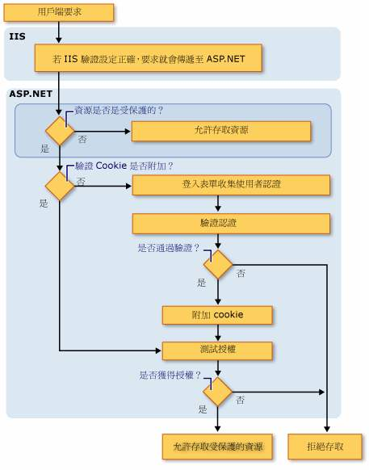
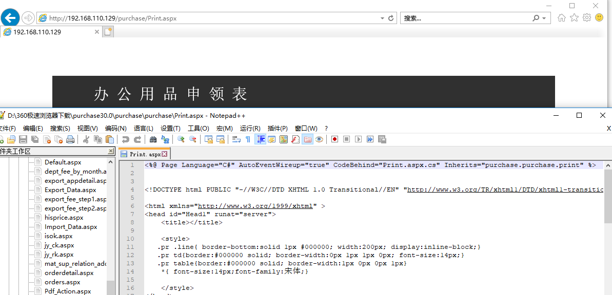
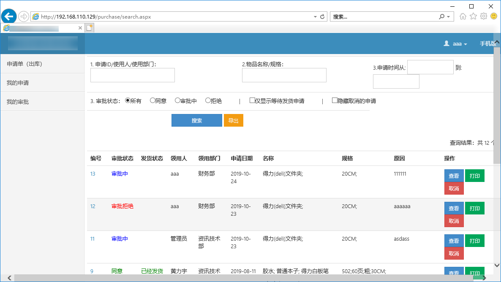
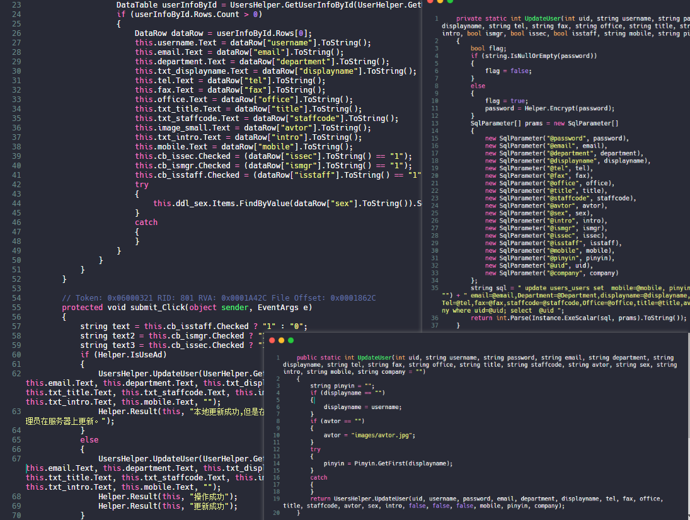
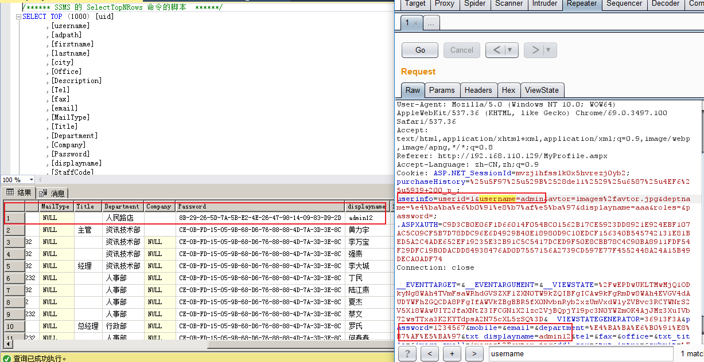
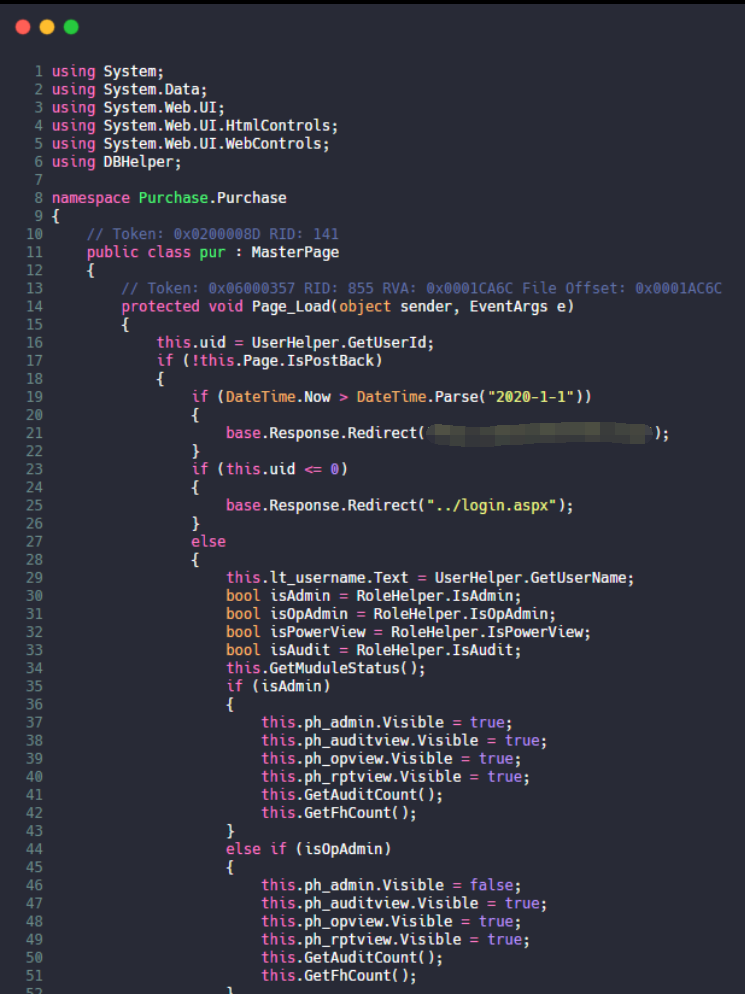
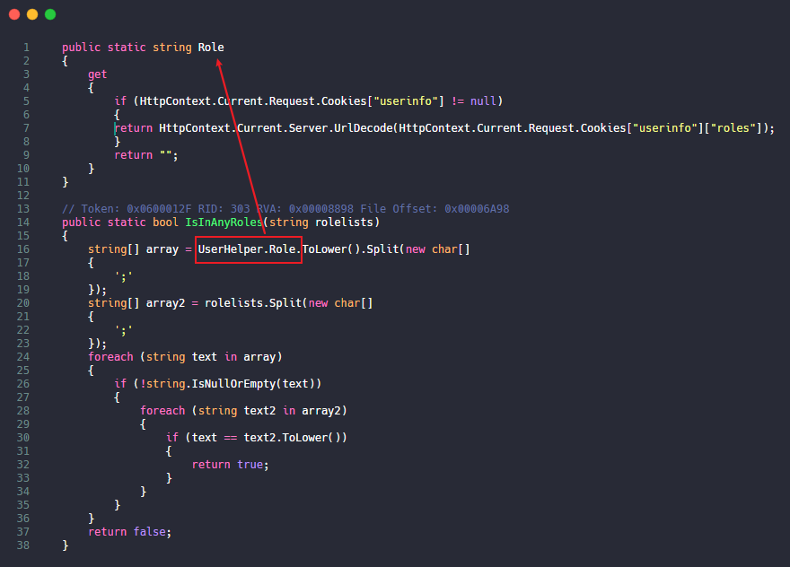
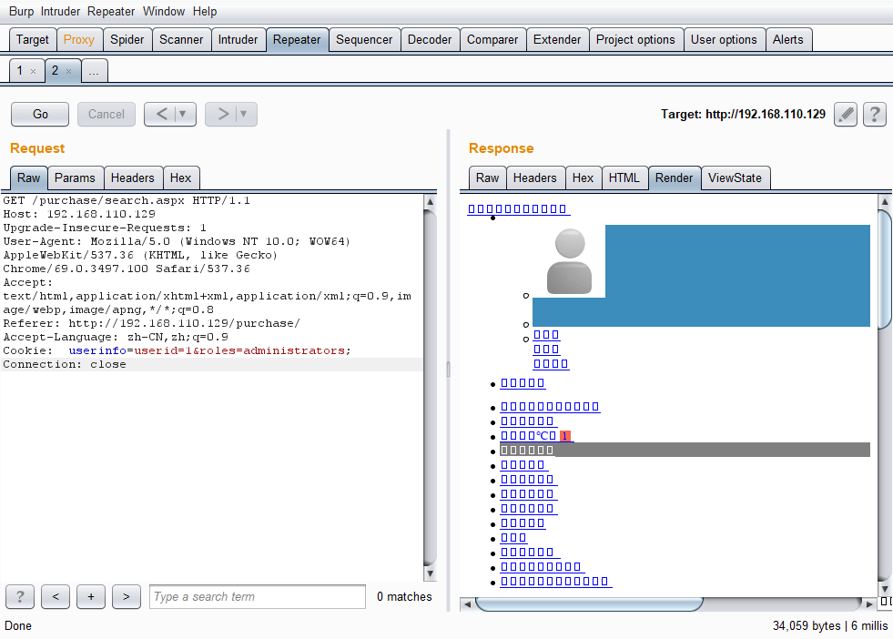

# 0x00 ASP.NET安全认证

1.在`web.config`中有四种验证模式：

方式|描述
-|-|-
window|IIS验证，在内联网环境中非常有用
Passport|微软集中式身份验证，一次登录便可访问所有成员站点，需要收费
Form|窗体验证，验证帐号/密码，Web编程最佳最流行的验证方式
None|表示ASP.NET自己根本不执行身份验证，完全依赖IIS身份验证

其中`FORM`窗体验证的流程图：



开启`form`窗体验证的同时还需要配置`web.config`，不然就会出现问题，一般来说还需要配置最基本的页面访问权限,比如禁止匿名用户访问。

```
<system.web>
    <authorization>
    <deny users="?"/>
    </authorization>
</system.web>

```
当然还可以设置一些管理页面允许某某用户访问等等，在这套程序中开启了`form`然后在程序里面验证的`cookies`，而且并没有设置所有页面的`authorization`。

2.除去`web.config`的配置通常还有两种写法来验证是否登陆。

第一种：在每个页面判断`Session["UserName"]是否等于null`

第二种：类似php的`include`的继承，这也是本套程序使用的方法。

首先他定义了一个`purchase.Master` [母版页](https://www.cnblogs.com/WuNaiHuaLuo/p/4509774.html) 在里面写上了权限验证的代码。


然后次母版页头文件会引入`MasterPageFile="~/purchase/purchase.Master"`调用之前都会先调用母版页的`Page_Load`函数来验证是否登陆。当然你也可能遇到没有使用[母版页](https://www.cnblogs.com/WuNaiHuaLuo/p/4509774.html)的程序，那么他可能是先定义一个`onepage`类继承`page`,然后其他页面继承`onepage`类，与此相同。


# 0x01 寻找越权


例1：

比如没有任何验证的，也没有继承验证类的，无需登陆访问





例2：

这套程序验证权限的地方比较少，只是简单的判断了是否登陆，登陆后基本可以访问大多数管理页面这里。





例3：



在`MyProfile.aspx`文件中 直接获取表单数据进行`update`，并没有验证权限，导致低权限账号也可以`update admin`但是这里是参数化查询，所以不存在注入。修改`admin`的账号密码为`1234567`。




例4：

前面说到这套程序里面验证的`cookies`，而且并没有设置所有页面的`authorization`权限，所以我们能不能伪造cookie呢。



在`23-26`行判断`this.uid`的值来进行跳转，在`16`行定义了他的值，跟进`UserHelper.GetUserId`

```
public static int GetUserId
{
    get
    {
        if (Helper.IsUseAd && HttpContext.Current.Request.Cookies["userinfo"] == null)
        {
            UsersHelper.LoginAd(UserHelper.GetSamaccountName());
        }
        if (HttpContext.Current.Request.Cookies["userinfo"] != null)
        {
            return int.Parse(HttpContext.Current.Request.Cookies["userinfo"]["userid"]);
        }
        return -1;
    }
}

```

`this.uid`等于`cookies`中获取的`userinfo`的值，这一步可以伪造，接着我们看到`30-33`这里他设置了管理员的布尔值，跟进`RoleHelper.IsAdmin`

```
public static bool IsAdmin
{
    get
    {
        string name = "IsAdmin";
        string admin = RoleHelper.Admin;
        bool? flag = HttpContext.Current.Session[name] as bool?;
        if (flag == null)
        {
            flag = new bool?(UserHelper.IsInAnyRoles(admin));
            HttpContext.Current.Session[name] = flag;
        }
        return flag.Value;
    }
}

```

前面从`session`中获取，如果`flag`为`null`则从`UserHelper.IsInAnyRoles(admin)`获取。

跟进`IsInAnyRoles`




可以看到只要我们传入的`cookies`中`roles`的等于传入的数组值就返回`true`其中 `public static string Admin = "administrators";`,所以构造`cookies`:`userinfo=userid=1&roles=administrators;`

